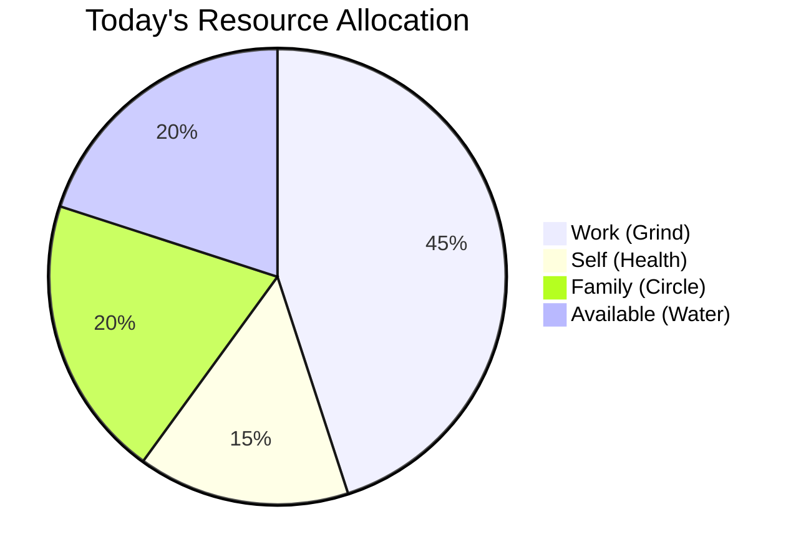

# Ledger Logic (Accounting)

This document defines the **Double-Entry Accounting System** for your life.
Just as financial ledgers track money, the Nu Ledger tracks **Time**, **Energy**, and **Focus**.

## 1. Core Concept: Resources are Finite
Every task creation is a **Debit** (Charge). Every completed focusing block is a **Credit** (Deposit/Settlement).
This allows us to answer: *"Can I afford this task today?"*

---

## 2. Chart of Accounts

### A. Resource Accounts (Assets)
These represent your available capacity.
*   **`Time` (Minutes)**: 24h/day, resets daily.
*   **`Energy` (Points)**: 100/day, decays with activity.
*   **`Focus` (Slots)**: ~3-4 Deep Work slots/day.

### B. Segment Accounts (Cost Centers)
Where the resources are spent. Mapped 1:1 with LifeFocus (LF).
*   **`Segment: Work`** (Linked to LF: Grind, LevelUp)
*   **`Segment: Self`** (Linked to LF: Self, Core, Insight)
*   **`Segment: Family`** (Linked to LF: Circle)
*   **`Segment: Play`** (Linked to LF: Play, Chaos)

---

## 3. Transaction Logic

### A. The Commitment Charge (Debit)
When a task is `Committed` (Collapsed from Quantum state), a charge is booked.

> **Example**: "Write Report (45m)"
> *   **Debit**: `Segment: Work` (+45m)
> *   **Credit**: `Account: Time` (-45m)

**Impact Analysis**:
*   The system calculates the **Net Workload Delta**.
*   If `Work Segment` > 8 hours, it flags "Overdraft Risk".

### B. The Settlement (Credit)
When a task is `Completed`.
> *   **Note**: Completion doesn't "return" time, it "settles" the debt. The time is gone, but the obligation is cleared.
> *   A "Focus Integrity Bonus" might be credited to `Account: Energy` if done flowfully.

---

## 4. The Waterfall Visualization

The **Day Waterfall** is the visual representation of the Ledger.
It answers: *"Where is my time going today?"*

### Visual Layers
1.  **Total Capacity (The Pot)**: ~16 awake hours.
2.  **Fixed Charges (Rocks)**: Meetings, Sleep, Commute (Calendar events).
3.  **Variable Charges (Sand)**: Tasks committed for today.
    *   Stacked by Segment (Color-coded).
4.  **Free Flow (Water)**: The remaining white space.

### Interaction
*   **Adding a Task**: Visually "pours" more sand into the pot.
*   **Deleting a Task**: Removes sand, water level rises.
*   **Overload**: If Sand + Rocks > Pot, the water turns Red (Alert).

---

## 5. Implementation Strategy
*   **Storage**: `ledger_entries` table in Postgres.
*   **Fields**: `id`, `taskId`, `accountId`, `amount`, `unit`, `direction` ("debit"|"credit").
*   **Computation**: Aggregation of `sum(amount)` by `accountId` for "Today".

