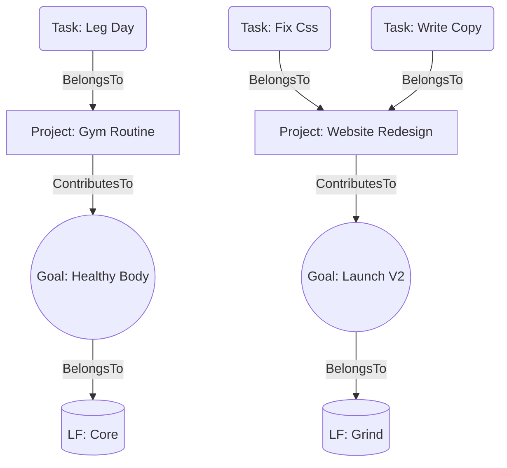

# Quantum Graph Architecture

This document defines the **WorldGraph**—the unified data structure that connects every atom of the user's life (Tasks, Projects, Goals, LifeFocus).
It enables the "Mental Map" visualization and powers intelligent accounting.

## 1. Core Concept: Everything is a Node
Instead of separate tables for Tasks vs Projects, we treat them as nodes in a unified graph.

### Node Types
| Type | Description | Example |
| :--- | :--- | :--- |
| **`Intent`** | A raw captured thought (from Spotlight). | "clean desk" |
| **`Task`** | A committed action atom with duration/time/energy. | "Wipe Surface (10m)" |
| **`Project`** | A container for related tasks/goals. | "Home Office Revamp" |
| **`Goal`** | A measurable outcome or state. | "Create a zen workspace" |
| **`LifeFocus`** | The 9 fundamental domains (1-9). | "Core (1)", "Grind (4)" |

---

## 2. Edges (Relationships)

### `BelongsTo` (Heirarchy)
*   **Behavior**: Strong ownership. If parent dies, child is orphaned/archived.
*   **Examples**:
    *   `Task("Buy paint")` -> `Project("Office Revamp")`
    *   `Project("Office Revamp")` -> `LifeFocus("Core")`

### `ContributesTo` (Impact)
*   **Behavior**: Soft linkage. Completion of A advances B.
*   **Examples**:
    *   `Task("Read Stoicism")` -> `Goal("Inner Peace")`
    *   `Project("Nu App")` -> `Goal("Financial Freedom")`

### `DependsOn` (Sequence)
*   **Behavior**: Blocker. B cannot start until A is done.
*   **Examples**:
    *   `Task("Deploy DB")` -> `Task("Migration Script")`

---

## 3. Data Flow & Visualization

### A. The Creation Flow (Graph-Aware)
1.  **Capture**: User types "Fix landing page".
2.  **Auto-Classification**: System detects `LF=5 (Level Up)` or `LF=4 (Grind)`.
    *   *Default*: If unsure, assign `LF=9 (Chaos)`.
3.  **Project Linking**: System scans open projects.
    *   Found `Project("Website Redesign")`.
    *   Suggests link: "Add to Website Redesign?"
4.  **Goal Mapping**:
    *   `Project("Website Redesign")` -> `Goal("Launch V2")`.
    *   Tracing the graph: `Task` -> `Project` -> `Goal` -> `LF`.

### B. The Visualization (Mental Map)
A visual rendering of the day layer by layer:

1.  **Life Focus Layer**: 9 pillars.
2.  **Goal Layer**: Active goals hanging from LFs.
3.  **Project Layer**: Active projects hanging from Goals.
4.  **Task Layer**: Leaves of the tree, executing today.

### C. The Day Waterfall (Timeline)
A specialized view of the graph projected onto time.
*   **X-Axis**: Time (Today).
*   **Swimlanes**: Segments (Work vs Self vs Family).
*   **Blocks**: Tasks committed to specific times.
*   **Flow**: "Water" (Available Time) flows around "Rocks" (Tasks).

---

## 4. Mermaid Schema

