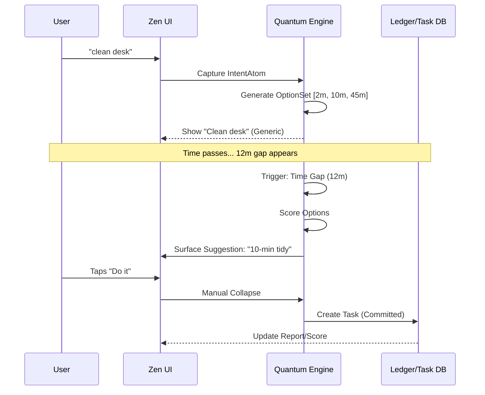

# Quantum Planning Layer (The Superposition)

This document defines the architecture for "Quantum Planning"—the layer that sits between **Capture** and **Commitment**.
It allows the system to hold multiple plausible futures at once and "collapse" them only when constraints force it.

## 1. The Core Concept

> **Hold multiple plausible futures at once, then "collapse" only when time/constraints force it.**

Traditional task managers force early commitment (Due Date, Priority) which creates friction.
Nu uses **Superposition** to keep options open.

### The Missing Primitive: `IntentAtom`
A captured thing that is not yet a task.
*   **Text**: "clean desk"
*   **Signals**: "2min", "urgency", "low energy"
*   **Status**: `floating` | `proposed` | `committed` | `discarded`

---

## 2. Domain Objects

### Option
A runnable candidate action derived from an IntentAtom.
*   `title`: "Quick Tidy"
*   **Duration**: 10 min
*   **Energy**: Low
*   **Cost**: Time/Money/Focus
*   **Value**: Impact Score

### OptionSet
A "superposition group" (choose 1..N later).
*   **Name**: "Desk cleanup variants"
*   **Members**: [`Option("2-min reset")`, `Option("10-min tidy")`, `Option("Deep clean")`]
*   **SelectionRule**: `pick1` | `pickK` | `any`
*   **CollapsePolicy**: `atBlockStart` | `byDueWindow` | `manual`

### Trigger
Events that update probability or force a collapse.
*   **Time**: "It is 9 PM"
*   **Context**: "Battery is low"
*   **External**: "Keerthi replied"
*   **Gap**: "12-minute calendar gap found"

### PlanState
The current "wavefunction" of the day.
*   **State**: { Slots (Jars), Constraints, OptionSets }
*   **Commitments**: 0 (initially)

---

## 3. The Rules of Collapse

A "collapse" converts an **Option** into a **Committed Task**.

1.  **Context Collapse**: If user enters "Deep Work" block -> Filter out `Energy:High` options only.
2.  **Time Collapse**: If a 15-min gap appears -> Surface `Duration <= 15m` options.
3.  **Manual Collapse**: User explicitly taps "Lock in" on a suggestion.
4.  **Decay Collapse**: If window passes -> Option is discarded or snoozed.

---

## 4. The Zen UI Experience

The user sees **NONE** of this complexity.

**User types**: "clean desk"

**System Backend**:
1.  Creates `IntentAtom("clean desk")`
2.  Generates `OptionSet`:
    *   Option A: "2-min reset"
    *   Option B: "10-min tidy"
    *   Option C: "45-min deep clean"
3.  Waits in superposition.

**Visible UI (Today List)**:
1.  Shows: "Clean desk" (generic)
2.  **Suggestion (Ghost)**: When a 12-minute gap appears, "10-min tidy" glows softly.
3.  **Action**: User taps "Do it" -> Collapse occurs -> Ledger updated.

---

## 5. The Quantum Algorithm (Deterministic)

1.  **Generate**: From templates (verb-based).
    *   Verb "clean" -> fetch `CleanTemplates` -> generate 3 variants.
2.  **Score**: By fit to current context.
    *   `Score = (TimeFit * EnergyFit * Value) - Cost`
3.  **Wait**: Keep in memory (superposition).
4.  **Collapse**: Trigger event fires -> Pick best Score -> Emit `TASK_COMMITTED` event.

---

## 6. Mermaid Flow

